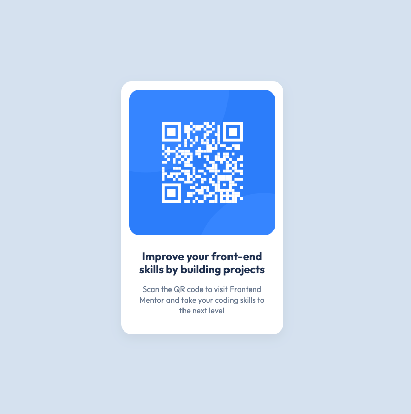

# Frontend Mentor - QR code component solution

This is a solution to the [QR code component challenge on Frontend Mentor](https://www.frontendmentor.io/challenges/qr-code-component-iux_sIO_H). Frontend Mentor challenges help you improve your coding skills by building realistic projects.

## Table of contents

- [Overview](#overview)
  - [Screenshot](#screenshot)
  - [Links](#links)
  - [Built with](#built-with)
  - [What I learned](#what-i-learned)
  - [Continued development](#continued-development)
  - [Useful resources](#useful-resources)
- [Author](#author)

## Overview

### Screenshot

### Links

- Solution URL: https://github.com/margaux-works/qr-code-component/
- Live Site URL: https://margaux-works.github.io/qr-code-component/

### Built with

- Semantic HTML5 markup
- CSS custom properties
- Flexbox
- Mobile-first workflow

### What I learned

- Use of Figma dev-mode
- Implementation of paddings and margin based on Figma design

### Continued development

- Flexbox

### Useful resources

- [A complete Guide to Flexbox ](https://css-tricks.com/snippets/css/a-guide-to-flexbox/) - This helped me to grab the CSS Flexbox layout concept.

## Author

- Frontend Mentor - [@margaux-works](https://www.frontendmentor.io/profile/margaux-works)
